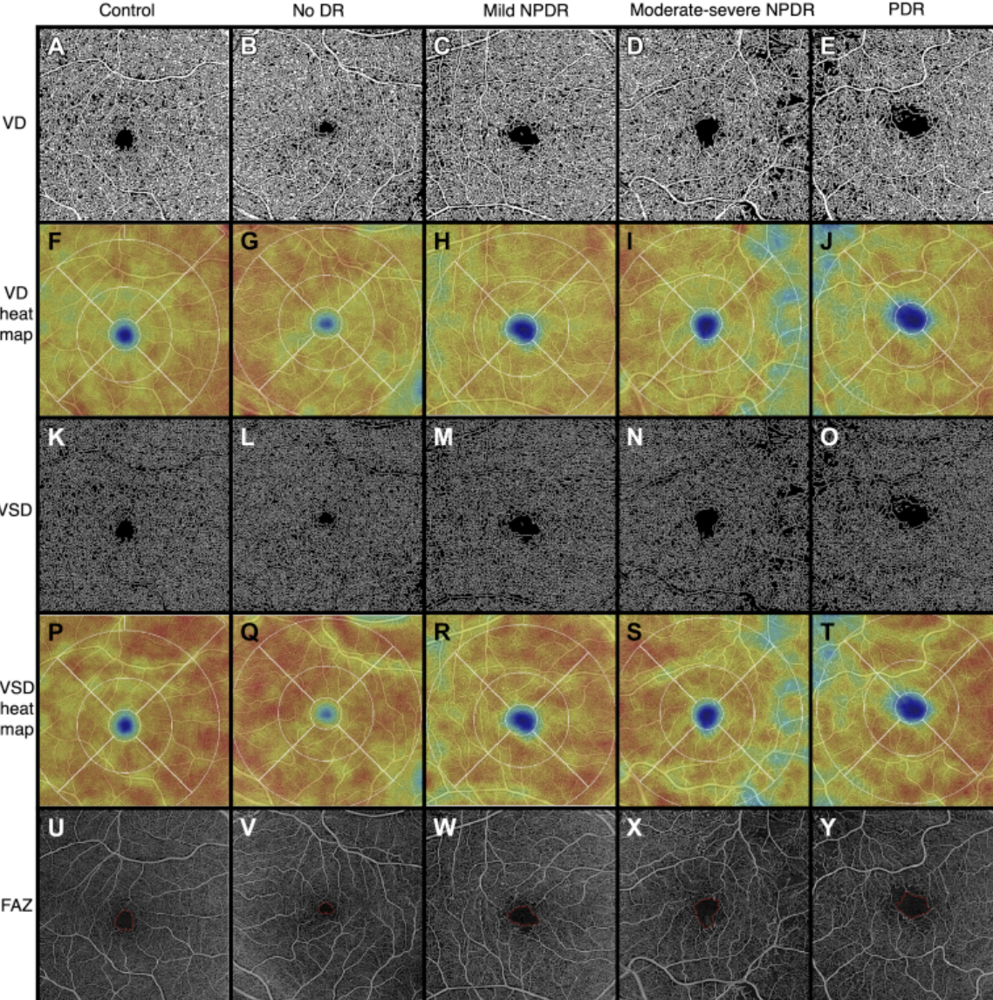
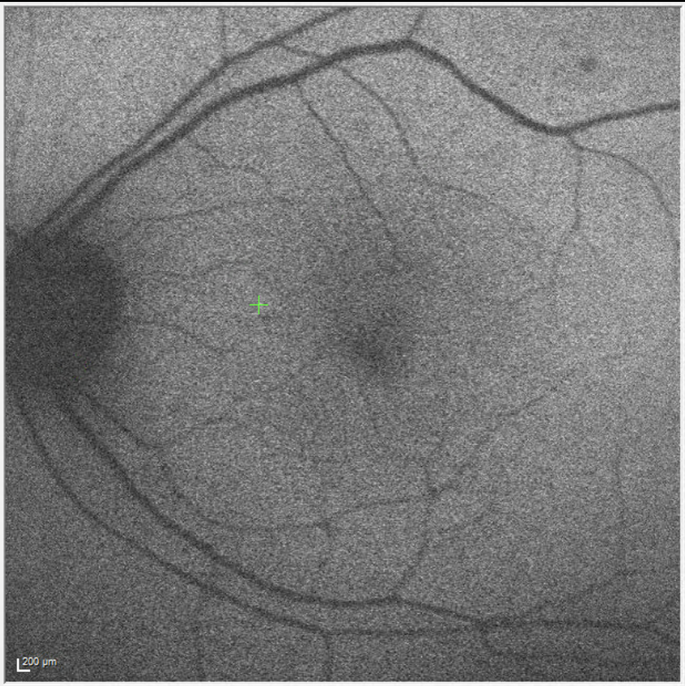
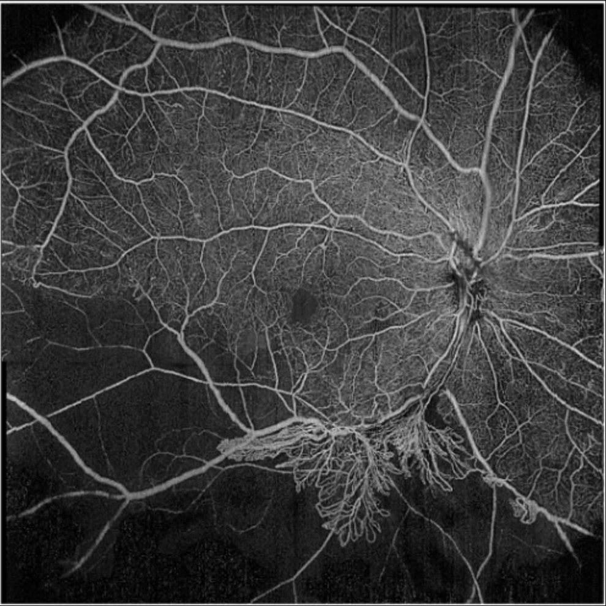

 

## OCT-Angiography

:::float-right-gang
 
First introduced in 1991, Optical Coherence Tomography (OCT) marks one of the biggest advances in ophthalmic imaging, which came out of a collaboration between MIT, Mass Eye and Ear, and MGH. As OCT technology advances, we aim to utilize our state-of-the-art devices, namely Swept-Source OCT-Angiography, to evaluate their utility in diagnosis and prognosis of ocular and systemic diseases, such as diabetic retinopathy and age-related macular degeneration. 
:::

## Biomarkers in Ophthalmic Imaging

:::float-left-gang

Early detection is often critical to treatment of diseases. Our current studies aim to identify novel and robust biomarkers, such as thinning of the vasculature, widening of the foveal avascular zone, and density within the multiple vascular layers, for patients with various retinal and choroidal disorders such as diabetic retinopathy and age-related macular degeneration and well as systemic diseases, such as Alzheimer’s disease, schizophrenia, and COVID-19 infection. 
:::

## Artificial Intelligence

Artificial intelligence (AI) is changing healthcare and has many potential applications in the field of retina. With collaborations within the MGB system, our lab aims to investigate the utility of machine learning in the context of retinal imaging research.