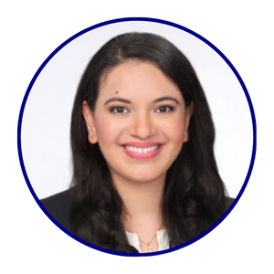
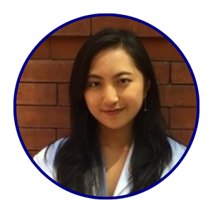
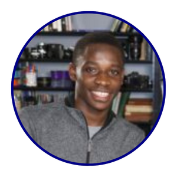

## PRINCIPAL INVESTIGATOR 

### [John B. Miller](https://eye.hms.harvard.edu/johnmiller)

:::float-left-gang
 

:::

## RESEARCH FELLOWS

Can include brief description here about their role in the lab

### [Filippos Vingopoulos, MD](https://scholar.google.com/citations?user=Hvk6GyUAAAAJ&hl=en)

:::float-left-gang

Brief Bio can go here
:::

### [Francesco Romano, MD FEBO](https://www.researchgate.net/profile/Francesco-Romano-2)

:::float-left-gang

Brief Bio can go here 
:::

### [Xinyi Ding, MD](https://scholar.google.com/citations?user=oBCg2RsAAAAJ&hl=zh-CN)

:::float-left-gang

Brief Bio can go here
:::

### [Itika Garg, MD](https://scholar.google.com/citations?user=g-kIS8kAAAAJ&hl=en)

:::float-left-gang

Brief Bio can go here
:::

## MEDICAL TRAINEES, RETINA DEPARTMENT

Can include brief description here about their role in the lab

### [Ines Lains, MD](https://scholar.google.com/citations?user=KmbKao8AAAAJ&hl=pt-PT)

:::float-left-gang

Brief Bio can go here 
:::

### [Neal Patel, MD](https://eye.hms.harvard.edu/people/neal-patel-md)

:::float-left-gang

Brief Bio can go here
:::

### [Edward (Ned) Lu, MD](https://eye.hms.harvard.edu/people/edward-ned-lu-md)

:::float-left-gang

Brief Bio can go here
:::

## MEDICAL STUDENT INTERNS

### Rebecca Zeng, BS

:::float-left-gang

MD Candidate, BU School of Medicine
:::

### Jocelyn Rodriguez, BS 

:::float-left-gang

MD Candidate, Harvard Medical School '24
:::

### Isabella Stettler, BS 

:::float-left-gang

MD Candidate, Tufts University School of Medicine 
:::

## RESEARCH ASSISTANTS 

### Hannah Wescott, BS 

:::float-left-gang

BS 
:::

### Augustine Bannerman, BA

:::float-left-gang

BA, Harvard College
:::

### Hannah Choi, BS 

:::float-left-gang

BS, University of Massachusetts - Amherst 
:::

### Ioanna Ploumi, BS

:::float-left-gang

BS Candidate, Northeastern University '23
:::

### Justin Bai, BS 

:::float-left-gang

BS Candidate, Harvard College '24
:::

### Katherine Overbey, BS

:::float-left-gang

BS Candidate, Johns Hopkins University '23
:::

### Cade Bennett, BS 

:::float-left-gang

BS, Vanderbilt University '23
:::

## Lab Alumni
