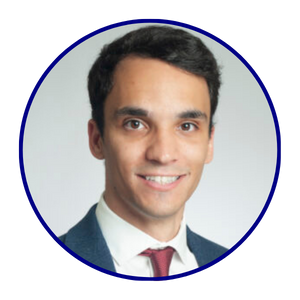
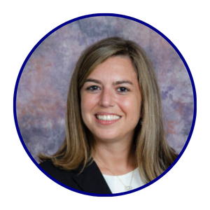
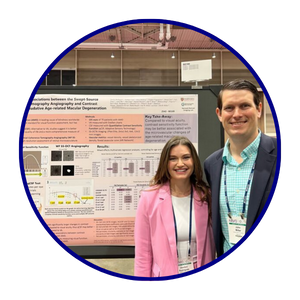
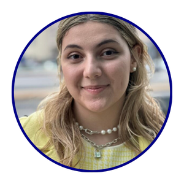
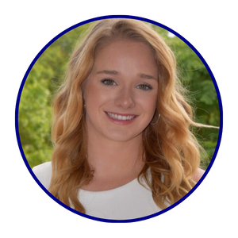

<script src="js/for_toc.js"></script>

 

```{r, echo = FALSE}

#referred to this for the colorized function: #https://bookdown.org/yihui/rmarkdown-cookbook/font-color.html

colorize <- function(x, color) {
  if (knitr::is_latex_output()) {
    sprintf("\\textcolor{%s}{%s}", color, x)
  } else if (knitr::is_html_output()) {
    sprintf("<span style='color: %s;'>%s</span>", color,
      x)
  } else x
}

```

## `r colorize("Principal Investigator", "darkblue")`

### [John B. Miller, MD](https://eye.hms.harvard.edu/johnmiller)

:::float-left-gang
 
This is an example bio that can be included with a lab group member's picture to describe their experience, background, interests and any other information that they would like to include in the lab website. The text will automatically wrap around the image of the person who is included in the webpage. We can have three to four sentences included in each description if necessary. The website will automatically space out the individuals listed to fit all the necessary information.  
:::

## `r colorize("Research Fellows", "darkblue")`

Can include brief description here about research fellows' roles

### [Filippos Vingopoulos, MD](https://scholar.google.com/citations?user=Hvk6GyUAAAAJ&hl=en)

:::float-left-gang

This is an example bio that can be included with a lab group member's picture to describe their experience, background, interests and any other information that they would like to include in the lab website. The text will automatically wrap around the image of the person who is included in the webpage. We can have three to four sentences included in each description if necessary. The website will automatically space out the individuals listed to fit all the necessary information.  
:::

### [Francesco Romano, MD FEBO](https://www.researchgate.net/profile/Francesco-Romano-2)

:::float-left-gang

This is an example bio that can be included with a lab group member's picture to describe their experience, background, interests and any other information that they would like to include in the lab website. The text will automatically wrap around the image of the person who is included in the webpage. We can have three to four sentences included in each description if necessary. The website will automatically space out the individuals listed to fit all the necessary information.  
:::

### [Xinyi Ding, MD](https://scholar.google.com/citations?user=oBCg2RsAAAAJ&hl=zh-CN)

:::float-left-gang

This is an example bio that can be included with a lab group member's picture to describe their experience, background, interests and any other information that they would like to include in the lab website. The text will automatically wrap around the image of the person who is included in the webpage. We can have three to four sentences included in each description if necessary. The website will automatically space out the individuals listed to fit all the necessary information.  
:::

### [Itika Garg, MD](https://scholar.google.com/citations?user=g-kIS8kAAAAJ&hl=en)

:::float-left-gang

This is an example bio that can be included with a lab group member's picture to describe their experience, background, interests and any other information that they would like to include in the lab website. The text will automatically wrap around the image of the person who is included in the webpage. We can have three to four sentences included in each description if necessary. The website will automatically space out the individuals listed to fit all the necessary information.  
:::

## `r colorize("Medical Trainees, Retina Department", "darkblue")`

Can include brief description here about medical trainees' roles

### [Ines Lains, MD](https://scholar.google.com/citations?user=KmbKao8AAAAJ&hl=pt-PT)

:::float-left-gang

This is an example bio that can be included with a lab group member's picture to describe their experience, background, interests and any other information that they would like to include in the lab website. The text will automatically wrap around the image of the person who is included in the webpage. We can have three to four sentences included in each description if necessary. The website will automatically space out the individuals listed to fit all the necessary information.  
:::

### [Neal Patel, MD](https://eye.hms.harvard.edu/people/neal-patel-md)

:::float-left-gang

This is an example bio that can be included with a lab group member's picture to describe their experience, background, interests and any other information that they would like to include in the lab website. The text will automatically wrap around the image of the person who is included in the webpage. We can have three to four sentences included in each description if necessary. The website will automatically space out the individuals listed to fit all the necessary information.  
:::

### [Edward (Ned) Lu, MD](https://eye.hms.harvard.edu/people/edward-ned-lu-md)

:::float-left-gang

This is an example bio that can be included with a lab group member's picture to describe their experience, background, interests and any other information that they would like to include in the lab website. The text will automatically wrap around the image of the person who is included in the webpage. We can have three to four sentences included in each description if necessary. The website will automatically space out the individuals listed to fit all the necessary information.  
:::

## `r colorize("Medical Student Interns", "darkblue")`

Can include brief description here about medical student interns' roles

### Rebecca Zeng, BS

:::float-left-gang

This is an example bio that can be included with a lab group member's picture to describe their experience, background, interests and any other information that they would like to include in the lab website. The text will automatically wrap around the image of the person who is included in the webpage. We can have three to four sentences included in each description if necessary. The website will automatically space out the individuals listed to fit all the necessary information.  
:::

### Jocelyn Rodriguez, BS 

:::float-left-gang

This is an example bio that can be included with a lab group member's picture to describe their experience, background, interests and any other information that they would like to include in the lab website. The text will automatically wrap around the image of the person who is included in the webpage. We can have three to four sentences included in each description if necessary. The website will automatically space out the individuals listed to fit all the necessary information.  
:::

### Isabella Stettler, BS 

:::float-left-gang

This is an example bio that can be included with a lab group member's picture to describe their experience, background, interests and any other information that they would like to include in the lab website. The text will automatically wrap around the image of the person who is included in the webpage. We can have three to four sentences included in each description if necessary. The website will automatically space out the individuals listed to fit all the necessary information.  
:::

## `r colorize("Research Assistants", "darkblue")`

Can include brief description here about research assistants' roles

### Hannah Wescott, BS 

:::float-left-gang

This is an example bio that can be included with a lab group member's picture to describe their experience, background, interests and any other information that they would like to include in the lab website. The text will automatically wrap around the image of the person who is included in the webpage. We can have three to four sentences included in each description if necessary. The website will automatically space out the individuals listed to fit all the necessary information.  
:::

### Augustine Bannerman, BA

:::float-left-gang

This is an example bio that can be included with a lab group member's picture to describe their experience, background, interests and any other information that they would like to include in the lab website. The text will automatically wrap around the image of the person who is included in the webpage. We can have three to four sentences included in each description if necessary. The website will automatically space out the individuals listed to fit all the necessary information.  
:::

### Hannah Choi, BS 

:::float-left-gang

This is an example bio that can be included with a lab group member's picture to describe their experience, background, interests and any other information that they would like to include in the lab website. The text will automatically wrap around the image of the person who is included in the webpage. We can have three to four sentences included in each description if necessary. The website will automatically space out the individuals listed to fit all the necessary information.  
:::

### Ioanna Ploumi, BS

:::float-left-gang

This is an example bio that can be included with a lab group member's picture to describe their experience, background, interests and any other information that they would like to include in the lab website. The text will automatically wrap around the image of the person who is included in the webpage. We can have three to four sentences included in each description if necessary. The website will automatically space out the individuals listed to fit all the necessary information.  
:::

### Justin Bai, BS 

:::float-left-gang

This is an example bio that can be included with a lab group member's picture to describe their experience, background, interests and any other information that they would like to include in the lab website. The text will automatically wrap around the image of the person who is included in the webpage. We can have three to four sentences included in each description if necessary. The website will automatically space out the individuals listed to fit all the necessary information.  
:::

### Katherine Overbey, BS

:::float-left-gang

This is an example bio that can be included with a lab group member's picture to describe their experience, background, interests and any other information that they would like to include in the lab website. The text will automatically wrap around the image of the person who is included in the webpage. We can have three to four sentences included in each description if necessary. The website will automatically space out the individuals listed to fit all the necessary information.  
:::

### Cade Bennett, BS 

:::float-left-gang

This is an example bio that can be included with a lab group member's picture to describe their experience, background, interests and any other information that they would like to include in the lab website. The text will automatically wrap around the image of the person who is included in the webpage. We can have three to four sentences included in each description if necessary. The website will automatically space out the individuals listed to fit all the necessary information.  
:::

## `r colorize("Collaborators", "darkblue")`

### [Tobias Elze, PhD](https://ophai.hms.harvard.edu/team/dr-elze/)

:::float-left-gang

Dr. Elze’s group works in the intersection between mathematics, computer science, and clinical ophthalmology.
:::


### [Paulo Lizano, MD](https://connects.catalyst.harvard.edu/Profiles/display/Person/118400)

:::float-left-gang

Dr. Lizano’s group aims to learn about visual pathway deficits in psychosis and learn how to carry out retinal and neuroimaging processing and analysis.
:::

### [Yakeel Quiroz-Gaviria, PhD](https://www.massgeneral.org/neurology/research/familial-dementia-neuroimaging-lab#:~:text=Overview,develop%20dementia%20later%20in%20life)

:::float-left-gang

The Familial Dementia Neuroimaging Lab is focused on the study of cognitive and brain changes that may predispose individuals to develop dementia later in life.
:::


## `r colorize("Lab Alumni", "darkblue")`

- Example Lab Member #1 (info about where they are now)
- Example Lab Member #2 (info about where they are now)

